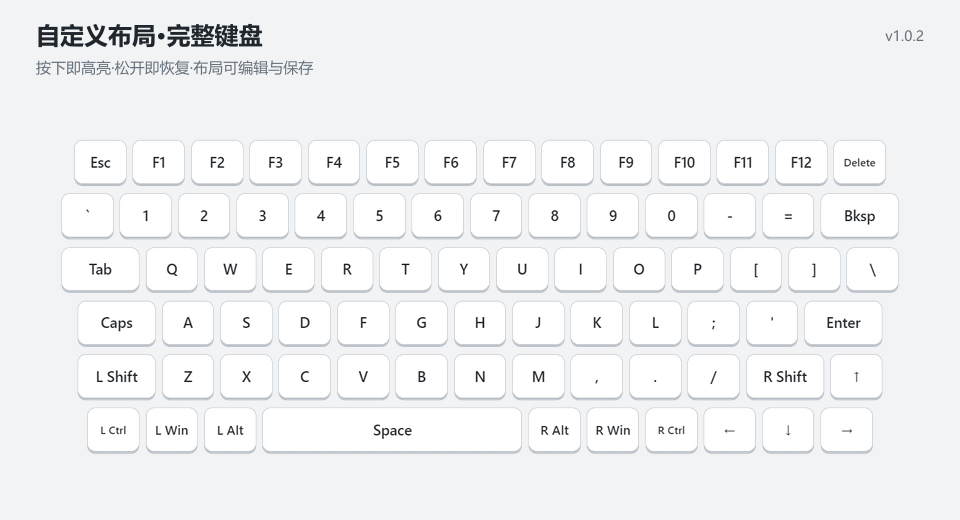
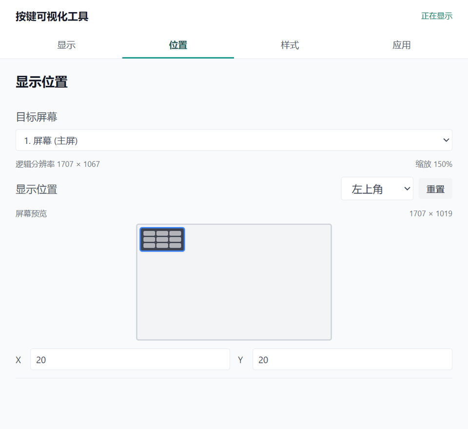
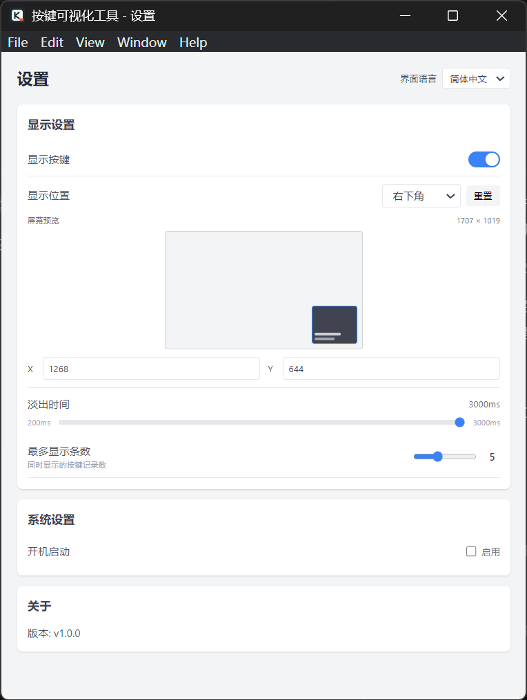
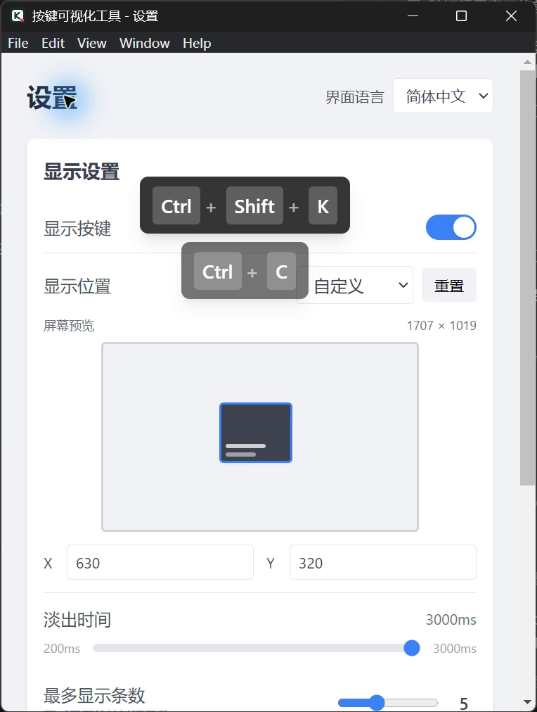

# Keystroke Visualizer

实时显示键盘按键与鼠标操作的桌面工具。

## 实际效果

以下截图与 GIF 均来自 Windows 上实际运行的应用。按键演示由真实输入事件触发，展示当前主分支构建的效果。

### 组合键、滚轮与淡出动画

按下 `Ctrl + C`、`Ctrl + Shift + K`，再向下、向上滚动鼠标：浮层实时显示操作，多条记录依次淡出。演示以应用设置窗口为背景。



### 可视化位置编辑

在设置的屏幕预览中拖动标记，浮层位置和 X / Y 坐标同步更新；也可以直接输入坐标微调。



<details>
<summary>查看中文设置与按键浮层截图</summary>

| 中文设置 | 按键浮层 |
| --- | --- |
|  |  |

</details>

## 下载与安装

从 [GitHub Releases](https://github.com/djunmaster/KeystrokeVisualizer/releases/tag/v1.0.0) 下载 Windows x64 版本：

| 文件 | 用途 |
| --- | --- |
| [Keystroke.Visualizer.Setup.1.0.0.exe](https://github.com/djunmaster/KeystrokeVisualizer/releases/download/v1.0.0/Keystroke.Visualizer.Setup.1.0.0.exe) | 安装版，可选择安装目录并创建快捷方式 |
| [Keystroke.Visualizer.1.0.0.exe](https://github.com/djunmaster/KeystrokeVisualizer/releases/download/v1.0.0/Keystroke.Visualizer.1.0.0.exe) | 便携版，无需安装 |

首次运行后，应用会在系统托盘驻留。通过托盘菜单打开设置，可调整显示位置、动画、显示数量和界面语言。浮层可直接拖动；设置页也支持可视化编辑位置与实时预览。

本次仅提供 Windows x64 安装包。安装包未进行代码签名，Windows 可能显示“未知发布者”提示。

> 当前主分支已修复 Windows 上浮层可能被其他窗口遮挡的问题，此修复尚未包含在 v1.0.0 下载包中。若遇到“显示按键”已开启但看不到浮层，可按下方开发说明构建当前源码。

## 功能特性

- ⌨️ 实时按键显示（支持组合键）
- 🖱️ 滚轮方向与鼠标中键显示
- 🔊 音量增大、减小与静音键显示
- 🎯 可拖拽的显示位置
- 🖥️ 设置内可视化编辑位置并实时预览
- ⏱️ 可调节的淡出动画
- 🚀 开机自启动支持
- 🌐 设置界面支持简体中文 / English 切换
- 🖥️ 提供 Windows 安装版与便携版；源码包含 macOS / Linux 打包配置

## 技术栈

- **框架**: Electron 28+
- **前端**: React 18 + TypeScript
- **样式**: Tailwind CSS
- **键盘监听**: uiohook-napi
- **配置存储**: electron-store
- **构建工具**: Vite
- **打包工具**: electron-builder

## 开发

### 安装依赖

```bash
npm ci
```

### 启动开发服务器

```bash
npm run electron:dev
```

### 构建 Windows 安装包

```bash
npm run build:win
```

## 项目结构

```
keystroke-visualizer/
├── src/
│   ├── main/           # Electron 主进程
│   ├── renderer/       # 前端渲染进程
│   │   ├── overlay/    # 按键显示窗口
│   │   ├── settings/   # 设置窗口
│   │   └── shared/     # 共享代码
│   └── preload/        # 预加载脚本
├── resources/          # 托盘图标等资源
└── docs/               # 文档
```

## 许可证

[MIT](LICENSE)
